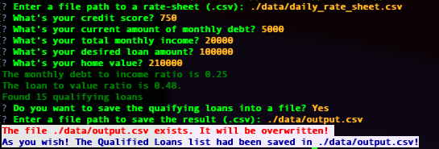

# Loan Qualifier Application

This is a python command-line interface application that will calculate for qualified loans within the data provided by the user. 
User will have the option to save the qualified loan list into a file.

---

## Technologies

This project uses python 3.9 with the following packages:

* [fire](https://github.com/google/python-fire) - Used for entry point and command line interface.

* [questionary](https://github.com/tmbo/questionary) - Used for interactive user prompts and dialogs

---

## Installation Guide

Please install the following dependencies prior to running the application.

```python
  pip install -r requirements.txt
```


---

## Usage

To use, run the **app.py** with:

```python
python app.py
```

Once launched, you will see the following prompts.



---

## Contributors

Contributed by Theena Dang (maria.cristina.dang@gmail.com)

---

## License

MIT